# User Admin CRUD Application

A reponsive web app where a user can log in or sign up for a new account, where he/she can add, view, edit, and delete data.

The project was built with Django and Django REST framework for the backend, React and Tailwind CSS for the Frontend, and elephantSQL for the Database hosting.

## User Cridentials

**Username:** admin

**Password:** admin

## Program Output

**Login Page**

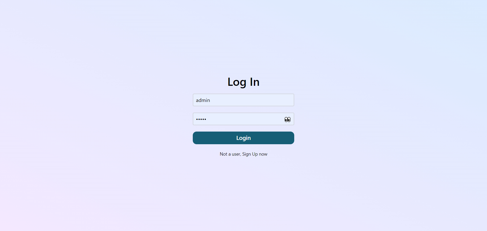

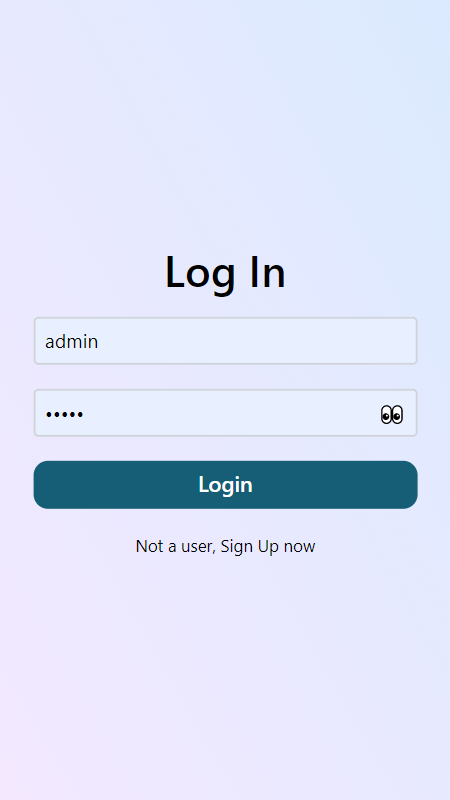

**Signup Page**

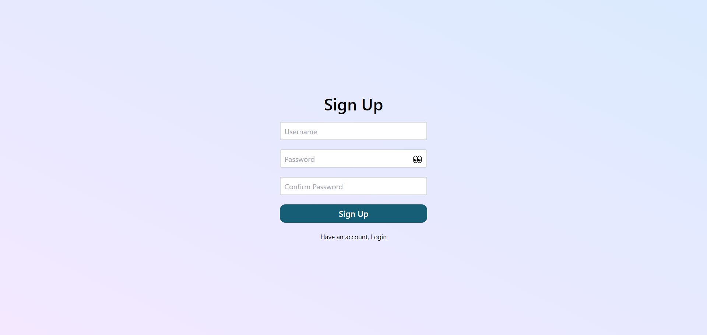

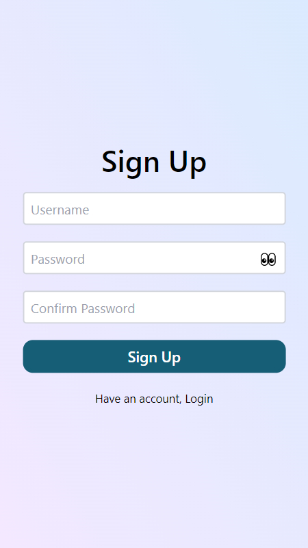

**Home Page**

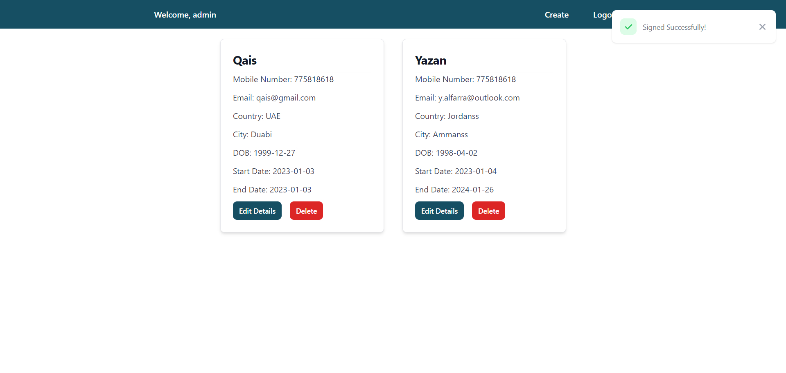

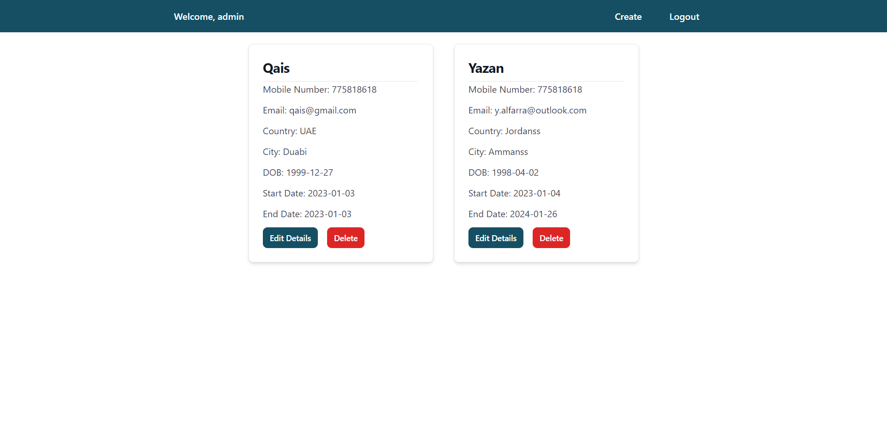

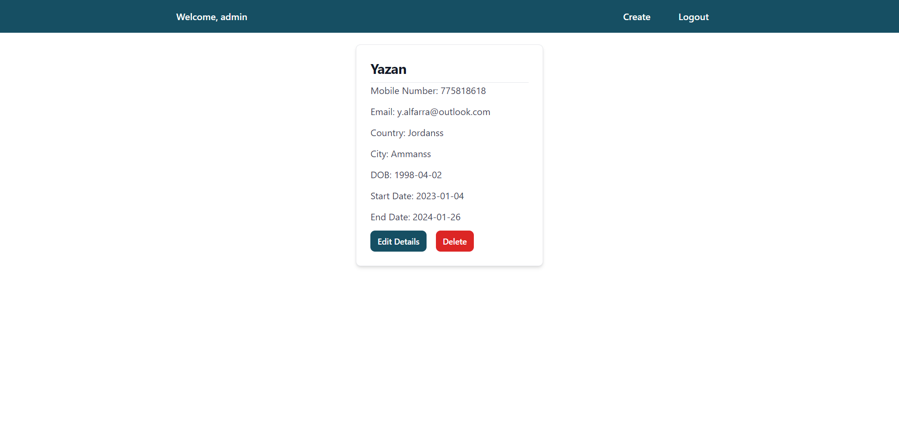

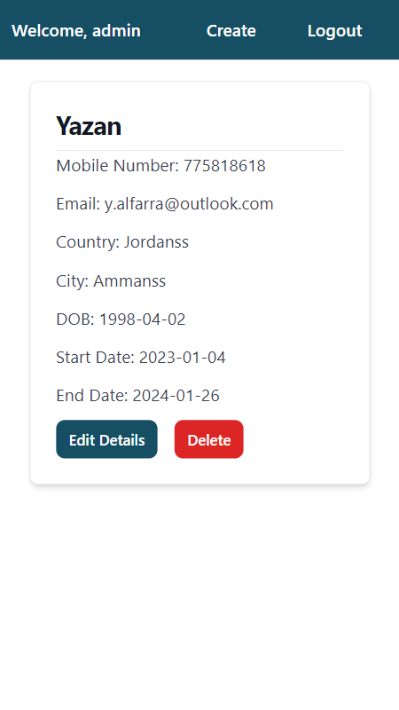

**Detailed Page**

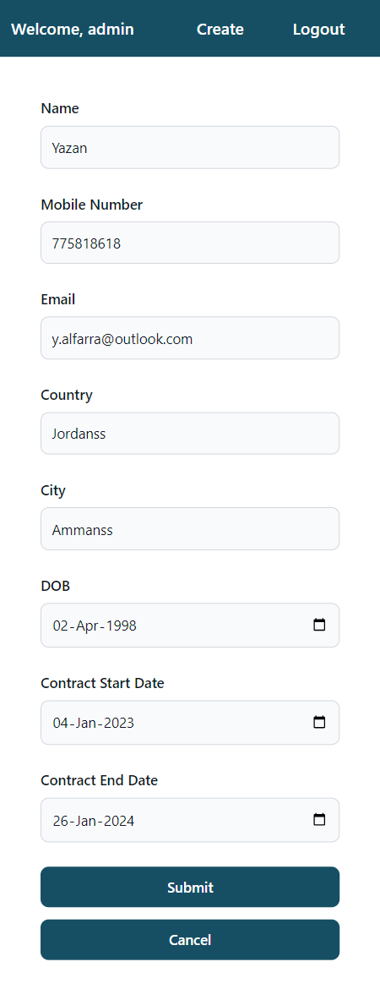

**Create Page**

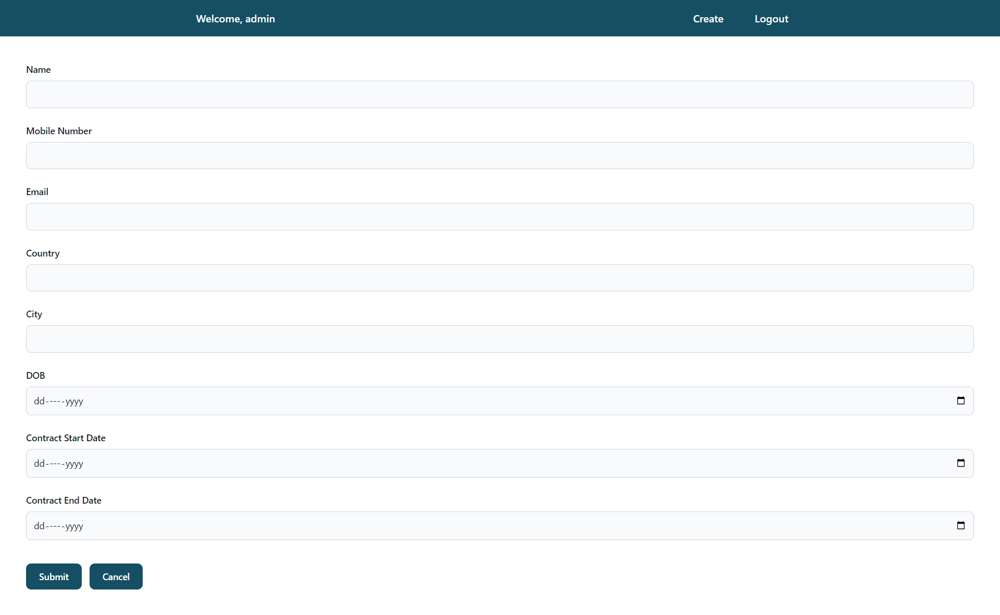

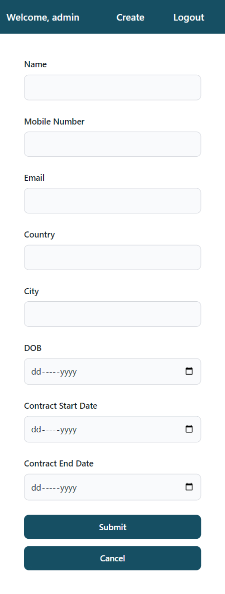

